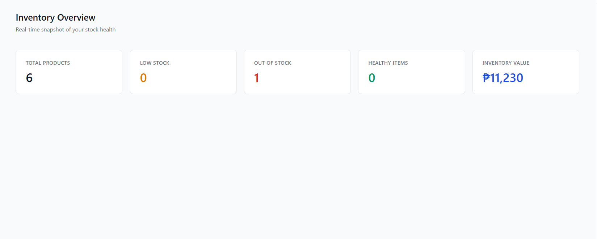
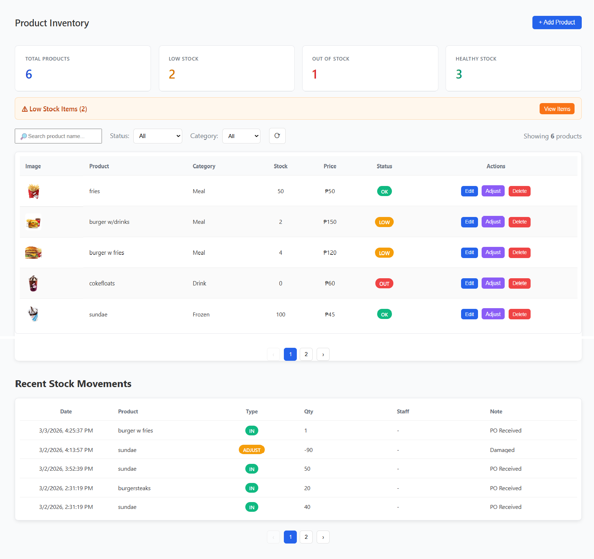
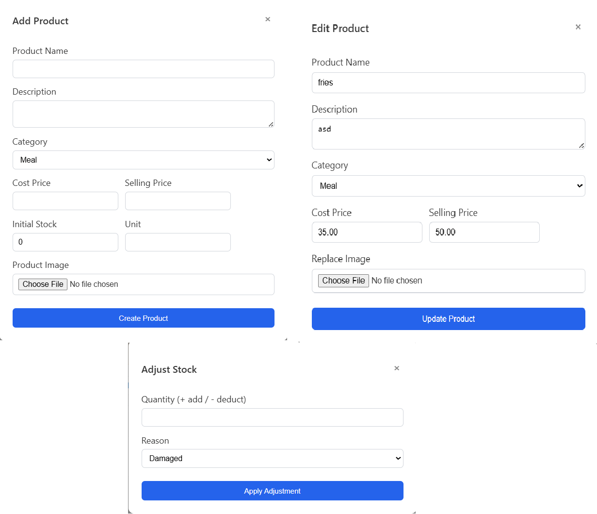
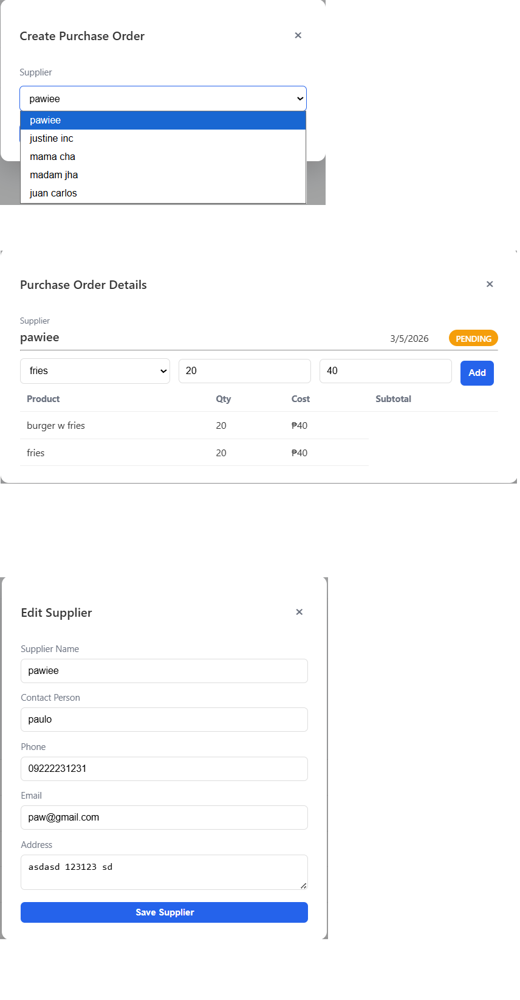

# Smart Inventory Management System

A full-featured inventory and procurement management system built with **Node.js, Express, MySQL, and EJS**.

This project was designed as a **portfolio-level system** to simulate real-world business inventory operations.

---

## Features

### Inventory Management
- Product creation and editing
- Image upload using Multer
- Auto-generated SKU system
- Stock level tracking
- Status indicators (Healthy / Low / Out)

### Inventory Intelligence
- Low stock alerts
- Stock movement audit trail
- Smart inventory metrics dashboard

### Procurement System
- Supplier management
- Purchase order creation
- Add items to purchase orders
- Receive orders to automatically update stock

### Stock Operations
- Stock adjustments
- Reason tracking (Damaged, Expired, Returned, Manual)

### Admin Dashboard
- Real-time metrics
- Product filtering
- Pagination
- Search functionality

### Security
- Helmet with strict CSP
- Session-based authentication
- Role-based access (Admin / Staff)

---

## Tech Stack

Backend
- Node.js
- Express.js
- MySQL
- express-session
- Helmet (CSP security)
- Multer (file uploads)

Frontend
- EJS templating
- Vanilla JavaScript
- Custom CSS

Development
- XAMPP MySQL
- Git

---

## Project Architecture

# Smart Inventory Management System

A full-featured inventory and procurement management system built with **Node.js, Express, MySQL, and EJS**.

This project was designed as a **portfolio-level system** to simulate real-world business inventory operations.

---

## Features

### Inventory Management
- Product creation and editing
- Image upload using Multer
- Auto-generated SKU system
- Stock level tracking
- Status indicators (Healthy / Low / Out)

### Inventory Intelligence
- Low stock alerts
- Stock movement audit trail
- Smart inventory metrics dashboard

### Procurement System
- Supplier management
- Purchase order creation
- Add items to purchase orders
- Receive orders to automatically update stock

### Stock Operations
- Stock adjustments
- Reason tracking (Damaged, Expired, Returned, Manual)

### Admin Dashboard
- Real-time metrics
- Product filtering
- Pagination
- Search functionality

### Security
- Helmet with strict CSP
- Session-based authentication
- Role-based access (Admin / Staff)

---

## Tech Stack

Backend
- Node.js
- Express.js
- MySQL
- express-session
- Helmet (CSP security)
- Multer (file uploads)

Frontend
- EJS templating
- Vanilla JavaScript
- Custom CSS

Development
- XAMPP MySQL
- Git

---

MVC architecture was used for maintainability and scalability.

---

## Screenshots

### Inventory Dashboard

### Product Management

### Product CRUD

### Purchase Orders

### Supplier Management

---

## Future Improvements

- POS System integration
- Barcode scanning
- Sales analytics
- Supplier performance metrics
- Inventory forecasting

---

## Author

Built by **Paolo Francisco** as a portfolio project demonstrating backend architecture, database design, and business system development.
